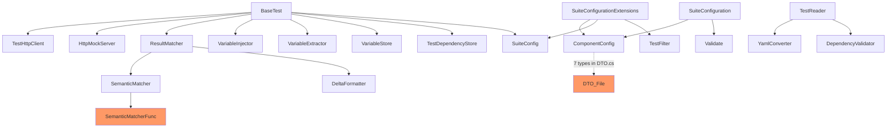
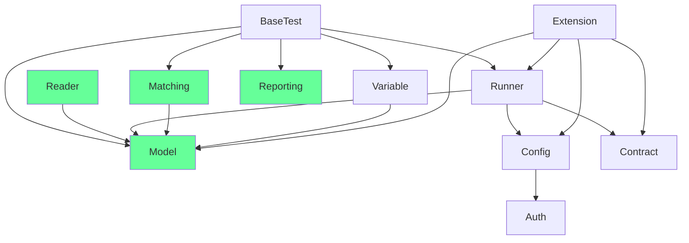

# Architecture Compass — ConfIT

## Session Status

| Phase                  | Status       | Agreed     |
|------------------------|--------------|------------|
| Scan + Interview       | complete     | —          |
| Current Architecture   | ✅ agreed    | 2026-06-06 |
| Recommended Direction  | ✅ agreed    | 2026-06-06 |
| Gap Assessment         | ✅ agreed    | 2026-06-06 |
| First Moves (Buckets)  | ✅ agreed    | 2026-06-06 |

---

## Repository Identity

- **Language:** C# / .NET (multi-target: net9.0, net10.0)
- **Type:** NuGet library — consumers extend `BaseTest` and write JSON/YAML test definitions
- **Size:** ~55 source files, single project `src/ConfIT/`
- **Test surface:** `test/ConfIT.UnitTest/` (library unit tests) + `example/User.ComponentTests/` + `example/User.IntegrationTests/` (regression gates)
- **Delivery:** NuGet release triggered by git tag; no manual publish
- **Scope:** Core library only (`src/ConfIT/`). Example projects are regression gates, not the subject of restructuring — they must stay compilable after every bucket.

---

## Why We're Doing This

No fires. This is proactive quality work on a well-written open-source library that has grown organically. Features (YAML config, variable system, semantic matchers, auth profiles, process launcher) landed in convenient places rather than the right places. The result is accretion marks: a `Server/` folder that contains no server code, a `Util/` folder that holds three unrelated concerns, a DTO hierarchy that does file I/O on itself, and a static config field that is a race condition in waiting.

No previous attempt. Starting fresh from a clean scan.

---

## Team Vision & Guardrails

**Config direction:** YAML is the future entry point. `SuiteConfiguration.LoadComponent()` / `LoadIntegration()` is where consumers will start. `SuiteConfig` (the manual property bag) is an internal adapter artifact heading toward internal visibility.

**Next capability areas:** Richer reporting (graphical output), better suite summaries, OpenAPI integration. The reporting seam needs explicit room to grow — it cannot stay co-located with unrelated utilities.

**Fixture ceremony:** Zero. Mandatory infrastructure (`VariableStore`, `TestDependencyStore`) stays as singletons. Consumers must not be asked to wire them up. This is a design value, not a gap. The singletons stay.

**Architectural style:** No formal pattern imposed. This is a pragmatic utility library. The goal is: right things in the right places, with clear seams for the next capabilities.

**Naming:** `Contract/` stays (already familiar in this repo; `Abstractions/` not adopted).

---

## Archaeology Findings

- **No dead code found.** Every module has active callers.
- **No duplicate functionality** — variable inject/extract/store are cleanly separated.
- **`VariableInjector.Inject()` clones via JSON round-trip** (`SerializeObject` + `DeserializeObject`) — implicit deep clone. Should become a named `TestCaseResolver.Resolve()` step (see Bucket 2).
- **`SemanticMatcher.ValidateSpecs()`** called per-test in `BaseTest.RunTest` — could be moved to load-time in `TestReader`. Low priority; note for later.
- **`BuilderExtension`** is `public static` but extends WireMock internals (`IRequestBuilder`, `IResponseBuilder`). Consumers will never call these directly. Should be `internal`.

---

## Domain Map

One bounded context — the test execution pipeline:

```
Test Definition (JSON/YAML on disk)
  → Reader          (parse, validate dependency order)
  → Resolver        (hydrate: load BodyFromFile, apply Override)
  → Injector        (substitute variables from VariableStore)
  → Executor        (HTTP call via TestHttpClient; mock setup via HttpMockServer)
  → Matcher         (status code + body diff + semantic assertions)
  → Extractor       (pull values from response into VariableStore)
  → Recorder        (status into TestDependencyStore; result into TestResultCollector)
```

This pipeline is the core concept. The transformation goal is to make each stage a legible, independently testable unit.

---

## Current Architecture

**Verdict: Drift.** The original intent (small, pragmatic, zero-ceremony) is sound. The structure has grown by accretion.

### Current folder layout

```
src/ConfIT/
├── BaseTest.cs, TestFilter.cs, TestDependencyStore.cs,
│   TestResultCollector.cs, TestRunStatus.cs, SemanticMatcherFunc.cs
├── Config/
│   ├── AuthProvider/   (AuthConfig + 3 provider implementations)
│   ├── DTO.cs          (7 public types in one file)
│   ├── SuiteConfig.cs  (manual property bag — used by BaseTest)
│   ├── SuiteConfiguration.cs (YAML loader — the future entry point)
│   └── Validate.cs
├── Constant/
│   └── EnvironmentKeys.cs  (one constant in its own folder)
├── Contract/           (4 consumer-facing interfaces)
├── Extension/          (5 extension classes including a heavy config mapper)
├── Server/
│   ├── Boot/           (AppLauncher, probes, AppLauncherException buried in Contract.cs)
│   ├── Dto/            (TestCase, TestApi, Matcher, HttpTestRequest, HttpTestResponse…)
│   ├── Http/           (TestHttpClient, TestSuiteInitializer)
│   └── Mock/           (HttpMockServer, BuilderExtension)
├── Util/               (ResultMatcher, SemanticMatcher, TestReader, DeltaFormatter,
│                        TestColor, YamlConverter, DependencyValidator — three concerns mixed)
└── Variable/           (VariableStore, VariableInjector, VariableExtractor + exceptions)
```

### Dependency diagram (actual names)



### Key violations

| # | Location | Issue |
|---|----------|-------|
| 1 | `BaseTest.cs:23` | `protected static SuiteConfig Config` — static field overwritten by every constructed test class. Race condition when two test classes with different configs run in parallel. |
| 2 | `BaseTest.cs:115` | `response.Content.ReadAsStringAsync().Result` — sync-over-async inside an `async Task` method. Blocks a threadpool thread unnecessarily. |
| 3 | `Config/DTO.cs` | 7 public types (`ComponentConfig`, `IntegrationEnvironmentConfig`, `StartupConfig`, `ApiConfig`, `MockConfig`, `FolderConfig`, `FilterConfig`) in one file named "DTO". No concept cohesion. |
| 4 | `Server/Dto/` | Test definition model used by everything (`BaseTest`, `VariableInjector`, `ResultMatcher`, `ITestProcessor`) lives under `Server/` as if it is server infrastructure. |
| 5 | `Server/` folder | Contains HTTP client, mock wrapper, process launcher, and data model. Nothing here is a server. |
| 6 | `SemanticMatcherFunc.cs` | Delegate type in root namespace `ConfIT` with no neighbours. Its only user is `SemanticMatcher` in `Util/`. |
| 7 | `TestApi`, `MockInteraction` | Both extend `ApiInteraction` with zero additional members. Type markers with no behaviour. |
| 8 | `Server/Boot/Contract.cs` | Mixes `IReadinessProbe` (internal, implementation detail) with `AppLauncherException` (public exception). A consumer can't find the exception without knowing this file exists. |
| 9 | `BaseRequestResponse.Initialize()` | A DTO that reads files from disk and mutates its own `Body` property. Untestable in isolation; hides a disk side-effect behind a method name that sounds benign. |
| 10 | `TestHttpClient.AddRequestHeaders()` | `_client.DefaultRequestHeaders.Clear()` before every call. `DefaultRequestHeaders` is shared across the `HttpClient` instance — concurrent `Execute()` calls corrupt each other's headers. |
| 11 | `TestFilter.cs` | `Tags` and `TestNames` are `{ get; set; }`. After factory construction nothing should mutate them. |
| 12 | `AuthConfig.cs` | Data DTO with embedded `ValidateAuth()` method. Inconsistent with the static `Validate` class used everywhere else. |
| 13 | `ResultMatcher`, `SemanticMatcher` | Call `.Should().Be…()` directly. Binds the matching core to FluentAssertions and makes "compute a diff" inseparable from "report failure". |
| 14 | `BuilderExtension` | `public static` but extends WireMock internals. Pollutes consumer IntelliSense. |
| 15 | `GlobalUsings.cs` | `global using ConfIT.Config` imports `SuiteConfig` everywhere. Feels core; will become odd as YAML becomes the entry point. |

---

## Recommended Direction

**Style: restore original intent.** No formal pattern imposed. The goal is a clean pipeline where each stage is legible, testable, and in the right place.

### Target pipeline (the governing idea)

```
YAML/JSON file
  → TestReader.GetTestsForAFolder()    [Reader/]
  → TestCaseResolver.Resolve()         [Reader/]   ← new
  → VariableInjector.Inject()          [Variable/]
  → TestHttpClient.Execute()           [Runner/Http/]
  → ResultMatcher.Match()              [Matching/]
  → VariableExtractor.Extract()        [Variable/]
  → TestResultCollector.Record()       [Reporting/]
```

Each arrow is a pure transform or a bounded side-effect. `BaseTest.RunTest()` becomes the coordinator of this pipeline, not the implementation of it.

### Target folder structure

```
src/ConfIT/
├── GlobalUsings.cs
│
├── [root — consumer surface only]
│   ├── BaseTest.cs
│   ├── TestFilter.cs
│   └── TestRunStatus.cs
│
├── Config/                              # YAML loading — future primary entry point
│   ├── SuiteConfiguration.cs            # Public: LoadComponent(), LoadIntegration()
│   ├── SuiteConfig.cs                   # Internal adapter target (heading toward internal)
│   ├── ComponentConfig.cs               # split from DTO.cs
│   ├── IntegrationConfig.cs             # split + rename from IntegrationEnvironmentConfig
│   ├── StartupConfig.cs                 # split from DTO.cs
│   ├── ApiConfig.cs                     # split from DTO.cs
│   ├── MockConfig.cs                    # split from DTO.cs
│   ├── FolderConfig.cs                  # split from DTO.cs
│   ├── FilterConfig.cs                  # split from DTO.cs
│   ├── Validate.cs                      # internal
│   └── Auth/
│       ├── AuthConfig.cs                # pure data, no ValidateAuth()
│       ├── BearerAuthTokenProvider.cs
│       ├── ApiKeyAuthTokenProvider.cs
│       └── OAuth2ClientCredentialsProvider.cs
│
├── Model/                               # Test definition model — used by everyone
│   ├── TestCase.cs                      # pure data, no Initialize()
│   ├── ApiInteraction.cs                # pure data, no Initialize()
│   ├── TestApi.cs                       # [open decision — see Bucket 2]
│   ├── MockInteraction.cs               # [open decision — see Bucket 2]
│   ├── HttpTestRequest.cs               # pure data
│   ├── HttpTestResponse.cs              # pure data
│   ├── TestMock.cs
│   ├── Matcher.cs
│   └── BaseRequestResponse.cs           # pure data, no Initialize() / ApplyOverride()
│
├── Contract/                            # Consumer extension points (unchanged)
│   ├── IAuthTokenProvider.cs
│   ├── ITestOutputLogger.cs
│   ├── ITestProcessor.cs
│   └── ITestProcessorFactory.cs
│
├── Matching/                            # Response validation subsystem
│   ├── SemanticMatcherFunc.cs           # delegate lives with its users
│   ├── SemanticMatcher.cs
│   ├── ResultMatcher.cs
│   ├── MatchResult.cs                   # future: decouple from FluentAssertions
│   └── DeltaFormatter.cs
│
├── Reporting/                           # Output and suite summary — room to grow
│   ├── TestResultCollector.cs
│   └── TestColor.cs
│
├── Variable/                            # Cross-test variable system (unchanged)
│   ├── VariableStore.cs
│   ├── VariableInjector.cs
│   ├── VariableExtractor.cs
│   └── Exception/
│       ├── AmbiguousVariableException.cs
│       ├── UndefinedVariableException.cs
│       └── VariableCollisionException.cs
│
├── Reader/                              # Test file loading, parsing, hydration
│   ├── TestReader.cs
│   ├── TestCaseResolver.cs              # new — owns file I/O and Override merging
│   ├── YamlConverter.cs
│   └── DependencyValidator.cs
│
├── Runner/                              # Execution infrastructure (was Server/)
│   ├── Http/
│   │   ├── TestHttpClient.cs
│   │   └── TestSuiteInitializer.cs
│   ├── Mock/
│   │   ├── HttpMockServer.cs
│   │   └── BuilderExtension.cs         # internal after Bucket 1
│   └── Boot/
│       ├── AppLauncher.cs
│       ├── AppLauncherConfig.cs
│       ├── AppLauncherException.cs      # split out
│       ├── ReadinessConfig.cs
│       ├── HttpReadinessProbe.cs
│       └── TcpReadinessProbe.cs
│
└── Extension/                           # Public extension methods
    ├── SuiteConfigurationExtensions.cs
    ├── JTokenExtensions.cs
    ├── DictionaryExtensions.cs
    ├── ListExtensions.cs
    └── StringExtensions.cs
```

### Target dependency direction



---

## Gap Assessment

### Must change — structural moves to reach target
- `Server/` → `Runner/` (rename)
- `Server/Dto/` → `Model/` (top-level)
- `Util/` → dissolve into `Matching/`, `Reader/`, `Reporting/`
- `Config/DTO.cs` → 7 individual files
- `SemanticMatcherFunc` → `Matching/`
- `TestResultCollector` → `Reporting/`
- `BaseTest.Config` static → instance field
- `BaseRequestResponse.Initialize()` → extract to `TestCaseResolver`
- `TestHttpClient` → `HttpRequestMessage` per call
- Fix sync-over-async in `BaseTest.RunTest`

### Should change — worth doing while the work is open
- `TestFilter` setters → `IReadOnlyList<string>` (no reason for mutability after construction)
- `AuthConfig.ValidateAuth()` → move into `SuiteConfiguration` validation
- `BuilderExtension` → `internal`
- `AppLauncherException` → own file, split from `Contract.cs`
- `Constant/EnvironmentKeys` → dissolve folder, inline constant
- `TestSuiteContext` record → reduce `BaseTest` constructor from 6 params

### Explicitly defer — not now
- `SuiteConfig` → `internal`: wait until all examples use the YAML path
- `FluentAssertions` decoupling via `MatchResult`: plant the type in Bucket 4, full migration later
- `TestApi`/`MockInteraction` empty class decision: surface as decision point in Bucket 2 — needs deliberate call before acting
- Singleton replacement: **explicitly out of scope** — zero-ceremony fixture is a design value

### Leave alone — already correct, do not touch
- `Variable/` subsystem — well-scoped, clean boundaries
- `Contract/` — thin but intentional; four clean interfaces
- `SuiteConfiguration.LoadComponent/LoadIntegration()` — the right public API shape
- `AppLauncher` internals — solid implementation, no structural issues
- `VariableStore`/`TestDependencyStore` singletons — design value, not a gap

---

## Transformation Buckets (First Moves)

The transformation is sequenced so each bucket leaves the codebase **shippable**: all tests pass, library compiles, example projects work. No half-done states. Each bucket is its own PR.

---

### Bucket 1 — Structural Skeleton
**Theme:** Move files to where they belong. Zero logic changes, zero behavior changes, zero public API changes. This is the map before any terrain is reshaped.

**Why first:** Every subsequent bucket works in the right namespace. A reviewer can see "this is where things belong" before any logic is touched. If something breaks after Bucket 1, it is a namespace reference — easy to diagnose.

**Tasks:**

| # | Task | Detail |
|---|------|--------|
| 1.1 | Rename `Server/` → `Runner/` | Move `Server/Http/` → `Runner/Http/`, `Server/Boot/` → `Runner/Boot/`, `Server/Mock/` → `Runner/Mock/`. Update all `namespace` declarations and `using` directives throughout. |
| 1.2 | Promote `Server/Dto/` → `Model/` | Move all files to top-level `Model/`. Update namespace from `ConfIT.Server.Dto` → `ConfIT.Model`. Update all `using` references. |
| 1.3 | Dissolve `Util/` | `ResultMatcher`, `SemanticMatcher`, `DeltaFormatter` → new `Matching/` (`ConfIT.Matching`). `TestReader`, `YamlConverter`, `DependencyValidator` → new `Reader/` (`ConfIT.Reader`). `TestColor` → new `Reporting/` (`ConfIT.Reporting`). |
| 1.4 | Move `SemanticMatcherFunc.cs` | Root namespace → `Matching/`. Namespace: `ConfIT.Matching`. |
| 1.5 | Move `TestResultCollector.cs` | Root namespace → `Reporting/`. Namespace: `ConfIT.Reporting`. |
| 1.6 | Split `Config/DTO.cs` | One file per type: `ComponentConfig.cs`, `StartupConfig.cs`, `ApiConfig.cs`, `MockConfig.cs`, `FolderConfig.cs`, `FilterConfig.cs`. Rename `IntegrationEnvironmentConfig` → `IntegrationConfig` in a new `IntegrationConfig.cs`. All stay in `ConfIT.Config`. |
| 1.7 | Dissolve `Constant/` | Move `EnvironmentKeys.TestEnvironment` constant inline into `SuiteConfiguration.cs` as a `private const`. Delete the folder. |
| 1.8 | Split `Server/Boot/Contract.cs` | `AppLauncherException` → its own `Runner/Boot/AppLauncherException.cs`. `IReadinessProbe` → stays `internal`; move declaration into `Runner/Boot/IReadinessProbe.cs`. |
| 1.9 | `BuilderExtension` → `internal` | Change `public static class BuilderExtension` → `internal static class BuilderExtension`. No functional change. |
| 1.10 | Update `GlobalUsings.cs` | Remove `global using ConfIT.Config` (now that `SuiteConfig` is not needed everywhere globally). Add targeted `using` in files that need it. |

**Verification:**
- `make unit` passes — all unit tests green
- `make component` passes — example component tests compile and run
- No consumer-visible namespace changed (`ConfIT.Model` is internal to the library; public types like `TestCase`, `Matcher` were in `ConfIT.Server.Dto` — this IS a namespace change for any consumer who referenced that namespace. See note below.)

> **Note on `ConfIT.Server.Dto`:** This namespace is technically public (the types are `public class`). Any consumer who wrote `using ConfIT.Server.Dto;` explicitly will get a compile error after Bucket 1. In practice, consumers access these types via `ITestProcessor.Before(TestApi api)` and the `JToken.ToTestCase()` extension — they rarely write the `using` explicitly. This should be called out in the release notes as a namespace change requiring a minor version bump.

**Tests:** No new tests written in Bucket 1. Run full suite to confirm no regression.

---

### Bucket 2 — Clean Data Model
**Theme:** Make `TestCase` and its sub-types genuinely inert data carriers. File I/O and Override merging move into a new `TestCaseResolver`. The pipeline gains its first explicit, testable transform stage.

**Why second:** Bucket 1 created `Model/` and `Reader/` — the right homes for what Bucket 2 produces. DTOs belong in `Model/` with no side effects. The resolver belongs in `Reader/` because loading test definitions is a reader concern.

**What changes in the pipeline:**
```
Before:
  token.ToTestCase(requestFolder, responseFolder)
    → .ToObject<TestCase>()
    → .Initialize()    ← disk I/O + mutation buried here

After:
  token.ToObject<TestCase>()              ← pure deserialization
  TestCaseResolver.Resolve(raw, ...)      ← explicit disk I/O, returns new instance
```

`JTokenExtensions.ToTestCase()` changes internally to call `TestCaseResolver.Resolve()`. Consumer call sites are unchanged.

**Tasks:**

| # | Task | Detail |
|---|------|--------|
| 2.1 | Create `Reader/TestCaseResolver.cs` | `public static class TestCaseResolver` with `Resolve(TestCase raw, string requestFolder, string responseFolder) → TestCase`. Logic: deep-clone raw (via `JsonConvert` as today, or explicit copy), load `BodyFromFile` for `api.request` and `api.response` from their respective folders, load `BodyFromFile` for each mock interaction request/response, apply `Override` merge after loading. Returns a fully hydrated `TestCase`. |
| 2.2 | Strip `BaseRequestResponse` | Remove `Initialize(string folder)` and `ApplyOverride(JToken payload)`. Class becomes a pure property bag. |
| 2.3 | Strip `ApiInteraction` | Remove `Initialize(string requestFolder, string responseFolder)`. Pure data. |
| 2.4 | Strip `TestCase` | Remove `Initialize(string requestFolder, string responseFolder)`. Pure data. |
| 2.5 | Update `JTokenExtensions.ToTestCase()` | Change implementation to: `jToken.ToObject<TestCase>()` → `TestCaseResolver.Resolve(raw, requestFolder, responseFolder)`. Method signature unchanged — consumers unaffected. |
| 2.6 | Open decision: `TestApi` / `MockInteraction` | Both are empty classes extending `ApiInteraction`. **Option A:** fold both into `ApiInteraction` (rename `ApiInteraction` → `TestApi`; `MockInteraction` becomes an alias or is removed). `ITestProcessor.Before(TestApi)` signature preserved. **Option B:** keep as named markers — document they are intentional type identifiers. Resolve this decision before executing 2.6. |
| 2.7 | `TestFilter` → immutable | `Tags` and `TestNames`: `public List<string> { get; set; }` → `public IReadOnlyList<string> { get; init; }`. Factory methods already set these once; no logic changes needed. |

**Verification:**
- `make unit` and `make component` pass
- Consumer call sites (`test.ToTestCase(...)`) compile and behave identically
- `BaseTest.RunTest` references `TestCaseResolver.Resolve()` (or the updated `ToTestCase()`) — verify the hydrated case looks the same as before

**New unit tests (write alongside Task 2.1):**

```
TestCaseResolver tests:
  Resolve_WithBodyFromFile_LoadsBodyFromDisk
  Resolve_WithBodyAndBodyFromFile_FileWins
  Resolve_WithOverride_MergesOnTopOfFile
  Resolve_WithNoBodyFromFile_LeavesBodyAsIs
  Resolve_MockInteractions_HydratesEachInteraction
  Resolve_FileNotFound_ThrowsWithUsefulMessage
  Resolve_NullRaw_ThrowsArgumentNull
```

These are pure unit tests — no HTTP, no WireMock, just files and JSON.

---

### Bucket 3 — Execution Pipeline Hardening
**Theme:** Fix the thread-safety issues in `BaseTest` and `TestHttpClient`. Introduce `TestSuiteContext` to reduce constructor noise. Fix the async bug. The pipeline is now clean end-to-end.

**Why third:** The data model is inert (Bucket 2). The pipeline in `BaseTest.RunTest` now reads: raw → resolved → injected → executed. Bucket 3 hardens the execution half of that chain.

**Tasks:**

| # | Task | Detail |
|---|------|--------|
| 3.1 | `BaseTest.Config` static → instance | Change `protected static SuiteConfig Config` → `protected readonly SuiteConfig _config`. Update all references inside `BaseTest` from `Config.X` → `_config.X`. |
| 3.2 | Introduce `TestSuiteContext` | New `public sealed record TestSuiteContext(TestHttpClient HttpClient, SuiteConfig Config, ITestProcessorFactory? ProcessorFactory, TestFilter? Filter, TestResultCollector? ResultCollector)` in root namespace. |
| 3.3 | Update `BaseTest` constructor | From 6-param to `protected BaseTest(TestSuiteContext context, ITestOutputLogger logger)`. Unpack context fields into instance fields inside the constructor. |
| 3.4 | Update example projects | `User.ComponentTests` and `User.IntegrationTests` fixtures pass a `TestSuiteContext` instead of individual args. This is the consumer-facing change — example projects are the migration guide. |
| 3.5 | Fix sync-over-async | `BaseTest.RunTest:115`: `response.Content.ReadAsStringAsync().Result` → `var content = await response.Content.ReadAsStringAsync()` then `JToken.Parse(content)`. |
| 3.6 | Fix `TestHttpClient` header mutation | Replace `_client.DefaultRequestHeaders.Clear()` + loop with building a fresh `HttpRequestMessage` per call. Auth header and custom headers set on the message, not the client. Use `_client.SendAsync(request)` instead of method-specific helpers. |
| 3.7 | `AuthConfig` → pure data | Remove `ValidateAuth()` from `AuthConfig`. Move its validation logic into `SuiteConfiguration.ValidateComponent()` and `ValidateIntegrationEnv()` directly. `AuthConfig` becomes a property bag. |
| 3.8 | `SuiteConfig` — signal direction | Add XML doc: `/// <remarks>Infrastructure config bag. For new suites, prefer <see cref="SuiteConfiguration.LoadComponent"/>.</remarks>`. No visibility change yet. |

**Verification:**
- `make unit`, `make component`, `make integration` all pass
- Example projects compile with the new constructor signature
- Two concurrent `Execute()` calls on the same `TestHttpClient` do not corrupt headers (testable with a simple parallel Task.WhenAll test)

**New unit tests:**

```
TestHttpClient tests:
  Execute_SetsAuthHeader_OnRequestNotOnClient
  Execute_CustomHeaders_SetPerRequest
  Execute_ConcurrentExecute_HeadersNotCorrupted

BaseTest context tests:
  Constructor_ConfigField_IsInstanceScoped (verifying Config is not static)
```

---

### Bucket 4 — API Surface Polish + Long-term Signals
**Theme:** Tidy the public surface. Plant structural markers for where the library is heading (reporting growth, FluentAssertions decoupling). No urgent fixes — all of this lands on stable ground after the heavy lifting.

**Why fourth:** Purely polish and direction-setting. Nothing in Bucket 4 is a prerequisite for anything else. Doing it last means it lands on a clean foundation.

**Tasks:**

| # | Task | Detail |
|---|------|--------|
| 4.1 | Introduce `MatchResult` | New `internal sealed record MatchResult(bool Passed, string? Description)` in `Matching/`. Not yet used — just plants the type. |
| 4.2 | Migrate matchers to return `MatchResult` | `ResultMatcher.MatchResponseBody()` and `SemanticMatcher.Apply()` return `MatchResult` instead of calling `.Should()` directly. `BaseTest.Verify()` receives `MatchResult` and owns the `false.Should().BeTrue()` call. FluentAssertions stays but is pushed to the boundary. |
| 4.3 | Rename `Extension/SuiteConfigurationExtensions` | Evaluate whether this should become a `ConfigurationMapper` static class (clearer intent) or stay as extension methods. Either way, document its role: "Adapts YAML-loaded config objects into library runtime types." |
| 4.4 | `BaseRequestResponse` rename | Current name sounds like it is both a request and response. Candidates: `HttpPayload`, `MessagePayload`. Choose one, apply across `Model/`. |
| 4.5 | Reporting extensibility marker | Add `ITestReporter` interface skeleton to `Reporting/` as an `internal` draft — documents where graphical/external reporting will plug in. Not wired up yet. |

**Verification:**
- All tests pass
- No public API changed (all Bucket 4 changes are internal or additive)

**New unit tests:**

```
MatchResult tests:
  MatchResponseBody_Returns_PassedResult_OnMatch
  MatchResponseBody_Returns_FailedResult_WithDescription_OnMismatch
  SemanticMatcher_Apply_Returns_PassedResult_OnValidUuid
  SemanticMatcher_Apply_Returns_FailedResult_WithMessage_OnInvalid
```

---

## Decision Log

| Decision | Status | Answer |
|----------|--------|--------|
| `Contract/` vs `Abstractions/` | ✅ resolved | Keep `Contract/` |
| Singletons: inject vs keep | ✅ resolved | Keep singletons — zero-ceremony is a design value |
| YAML vs manual config: future direction | ✅ resolved | YAML is the destination; `SuiteConfig` heads toward internal |
| `TestCaseResolver` as first move or direction | ✅ resolved | First move — Bucket 2 |
| `TestApi`/`MockInteraction` empty classes | 🔲 open | Resolve at start of Bucket 2 |
| `SuiteConfig` → `internal` timing | 🔲 open | After example projects fully migrate to YAML path |

---

## Progress Log

- **2026-06-06** — Full scan conducted. Four-act interview completed (Q1: YAML future, Q2: reporting/OpenAPI, Q3: singletons stay). Cross-referenced with external model analysis — 6 net-new findings incorporated (async bug, `TestFilter` mutability, `BuilderExtension` visibility, `TestHttpClient` header mutation, `TestCaseResolver` pattern, FluentAssertions coupling). Current architecture agreed. Recommended direction agreed. Four-bucket transformation plan agreed. Insights document written.
