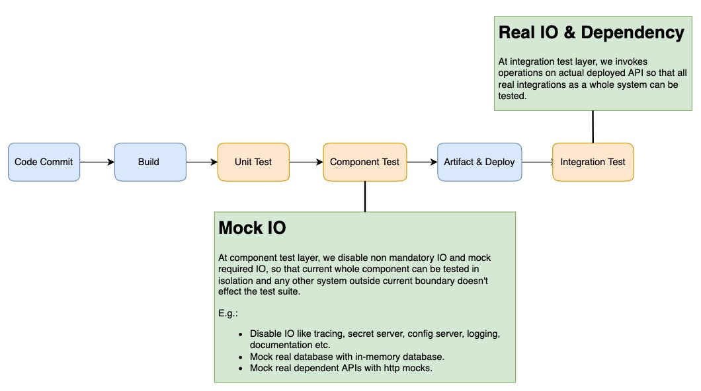

# ConfIT

[](https://github.com/techygarg/ConfIT/actions/workflows/build.yml)
[](https://www.nuget.org/packages/ConfIT/)

ConfIT is a .NET library for declarative API integration testing. Define tests in JSON or YAML — no boilerplate for the common case. ConfIT handles request execution, mock setup, response matching, variable extraction, and test filtering; you write the test definitions.

It works at two levels: **component tests** (service runs in-process, external dependencies mocked via WireMock) and **integration tests** (full environment, real services). Both levels use the same DSL and the same xUnit setup pattern.

📖 [ConfIT — A Declarative Way to Define Your Integration Tests](https://www.linkedin.com/pulse/confit-declarative-way-define-your-integration-tests-rahul-garg/) — background and motivation from the author.

---

## Why ConfIT



Component and integration tests share a large common surface — how tests are defined, how requests are built, how responses are matched. ConfIT abstracts that surface so you write it once.

- **Readable test definitions.** A JSON or YAML file is easier to scan than C# test code, and easier for QA and non-engineers to contribute to.
- **No repeated boilerplate.** Adding a test is editing a file — not creating a new class, wiring up a factory, and writing assertions by hand.
- **One format across both test levels.** The same test definition works in a component suite (with mocks) and an integration suite (without) by changing only the fixture configuration.
- **Rich assertion model.** `ignore`, `pattern` regex, and `semantic` type-aware matchers handle dynamic fields (IDs, timestamps, server-assigned values) declaratively.
- **Declarative data flow.** `extract` captures values from responses; `{{inject}}` passes them forward — no C# required for the typical create-then-retrieve pattern.
- **Language-agnostic.** With [AppLauncher](doc/app-launcher.md), ConfIT runs any shell command and speaks HTTP — test a Go API, a Node.js service, or a Python microservice using the same test files. Your API manages its own test environment; ConfIT just invokes the command.

---

## Getting Started

→ **[Suite Setup](doc/suite-setup.md)** — install the package, write a `suite.config.yaml`, and call `SuiteBootstrapper.ForComponent` / `ForIntegration` / `ForCommand` — that's the fixture. Start here.

→ **[Test Execution Flow](doc/test-execution-flow.md)** — ASCII flow diagrams showing what happens at runtime across all three suite types.

---

## Documentation

### Writing Tests

| Document | What it covers |
|---|---|
| [Test File Format](doc/test-file-format.md) | Full DSL reference — every field in JSON and YAML, `bodyFromFile`, `override`, multi-file rules |
| [Mock Interactions](doc/mock-interactions.md) | Declaring WireMock stubs inline for component tests — request matching, response definition, YAML anchor reuse |
| [Test Filtering](doc/test-filtering.md) | Running a subset by tag (`TEST_TAGS`) or name (`TEST_NAMES`), CI patterns |

### Assertions and Data Flow

| Document | What it covers |
|---|---|
| [Matchers and Patterns](doc/matchers-and-patterns.md) | `ignore`, `pattern` regex, `semantic` named matchers (`isUuid`, `greaterThan`, `isEmail`, …), custom matchers |
| [Variable Extraction + Injection](doc/variable-extraction-and-injection.md) | `extract` from responses, `{{varName}}` injection into later tests, `${ENV}` for environment values |
| [Test Dependency Graph](doc/test-dependency-graph.md) | `depends:` field — skip dependents when a prerequisite fails, cascading skip propagation, load-time validation |

### Suite Startup Modes

| Document | What it covers |
|---|---|
| [AppLauncher](doc/app-launcher.md) | Out-of-process startup — run any language/framework, app manages its own test environment, language-agnostic testing |

### Auth

| Document | What it covers |
|---|---|
| [Auth Profiles](doc/auth-profiles.md) | Bearer, OAuth2 client credentials, API key — declarative YAML config; custom `IAuthTokenProvider` for signing and complex flows; OAuth2 WireMock testing pattern; YAML-based header verification |

### Operations and Extension

| Document | What it covers |
|---|---|
| [Reading Failure Output](doc/failure-output.md) | Per-field failure messages, path notation, suite summary table, debugging tips |
| [Extending ConfIT](doc/extending-confit.md) | `ITestOutputLogger`, `ITestProcessor` / `ITestProcessorFactory` hooks, custom semantic matchers, `IAuthTokenProvider` |

---

## Example Projects

The `example/` directory contains a working reference implementation:

| Project | Role |
|---|---|
| [`User.Api`](example/User.Api) | Sample ASP.NET Core service — user creation and retrieval |
| [`JustAnotherService`](example/JustAnotherService) | Sample dependency service — email validation |
| [`User.ComponentTests`](example/User.ComponentTests) | Component test suite — in-process server, WireMock dependencies |
| [`User.ComponentTests.AppLauncher`](example/User.ComponentTests.AppLauncher) | Component test suite — AppLauncher (command) mode; app starts as external process, no project reference |
| [`User.IntegrationTests`](example/User.IntegrationTests) | Integration test suite — real services, SQLite database |

---

## Running the Examples

```bash
make              # build + unit + component tests (default)
make component    # component tests only
make integration  # wipe DB, start services, run integration tests, stop
make unit         # library unit tests only
make ci           # full pipeline
make help         # list all targets
```

Filter at runtime without changing code:

```bash
TEST_TAGS=smoke dotnet test    # tag filter
TEST_NAMES=ShouldCreateAUser dotnet test    # name filter
```
