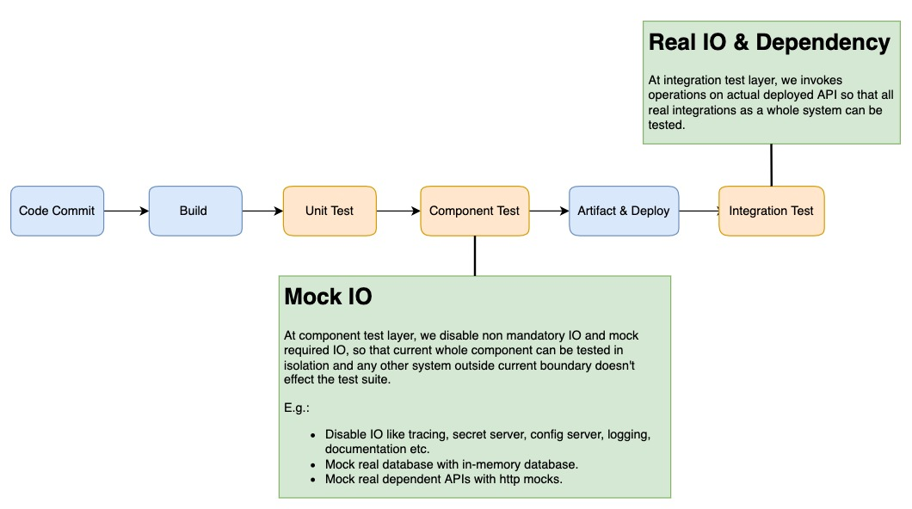

# ConfIT

[](https://github.com/techygarg/ConfIT/actions/workflows/build.yml)

## Table Of Content

- [What](#what)
- [Why](#why)
    - [Type Of Tests](#type-of-tests)
- [How](#how)
    - [Code Structure](#code-structure)
    - [DSL](#dsl)
        - [Request](#request)
        - [Response](#response)
        - [Matchers](#matchers)
        - [Mocks](#mocks)
        - [Refer For Examples](#refer)
    - [Run](#run)

## What

`ConfIT` is a library which is taking shape to optimise the Api integration test process. The library equipped with all
necessary bells & whistles required to automate several repeated tasks in the test suite. The library add support to
quickly manage tests through easy and rich `DSL` in `json` files via declarative way rather than through code everytime.
The library process all json files, where we have defined our tests, convert them into actual test cases and invoke them
against the configured server. 

One important point is that `ConfIT` is not a test framework like `xUnit` or `nUnit` but it is a library which can
integrate with these frameworks. Please refer [Code Structure](#code-structure) section for more details.

## Why

### Type Of Tests

Let's discuss the below diagram for different test stages in a test pyramid.



The above flow has three test states. Unit, component and integration tests.

* Unit tests, as we all know, developers write these tests to test a smallest unit of functionality.
* Component tests are to test one whole component without direct dependency on anything outside the component boundary.
    * Developers usually write these tests.
    * If we have one microservice, e.g.: `Order` service, we are referring whole Order service as a single component.
    * In this state, we try to mock all `IO` so that the component internal integration can be tested in isolation.
    * We mock http dependencies, disable not required integration or use in-memory
      versions, `so that the component tests will not fail due to any dependency direct behaviour`.
* Integration tests, are the tests which we run in actual QA or CI environments once the code has been deployed.
    * QA usually write these tests.
    * As we run these tests in actual environment, all tests invoke actual integrations.

If we look component and integration tests, they have several similarities on how we define and execute these tests and
that's why we decided to abstract this commonality into a library.

Below are the few initial reasons that why this library was created

* Reduce the gap and increase the usability between component & integration tests
* Enhance test readability
    * Test cases are one of the way to dive into functionality and that's why they are very often refer by different
      team members to understand the business flow and need.
    * It is very big process overhead if everyone needs to understand code everytime to understand business flow of the
      tests, keeping on-boarding also into the account.
* Remove repetitive tasks and increase test process efficiency. Once base is set up, adding/ updating a test should be a
  few minute job rather than hours or days.
* Reduce tech dept and need for continuous refactoring for test cases and code
* Remove the need to pick different frameworks, language for unit, component and integration tests.

## How

### Code Structure

Let's first see how code is segregated on the higher level.

* [Library code](./src), it contains the `ConfIT` library code.
    * The library is not tightly coupled with any specific test framework.
* [Example code](./example), it contains following parts.
    * **Code**
        * [User API](./example/User.Api), a demo service, which has some basic user creation and user retrieval
          operation.
        * [JustAnotherService](./example/JustAnotherService), a demo dependency service, which has some email verify
          operations.
            * It is added to demonstrate real world service dependencies scenario and how to entertain in our tests.
            * `User Api` uses `JustAnotherService` to full fill user creation.
    * **Test**
        * Tests are using `xUnit` as the test framework and using `ConfIT` library to automate process.
        * [User Component Tests](./example/User.ComponentTests), it contains `User Api` component tests and set up code.
        * [User Integration Tests](./example/User.IntegrationTests), it contains `User Api` integration tests and set up
          code.

### DSL

Tests is defined in declarative way in `json` files. The `DSL` supports below attributes.

* #### Request:
    * It is the test request which we we want to run on our test server. It has following parameters.
    * `Method`
        * HTTP method (GET, POST, PUT, PATCH, DELETE)
    * `Path`
        * Url path
    * `Headers`
        * Provide details if you want to add headers in the request
        * ```json 
          "headers": {"name":"value"}
    * `Body`
        * It is request payload, if http method is POST, PUT or PATCH
    * `BodyFromFile`:
        * Several times, we need to read request payload from file.
        * We can provide file name and library will read the content of file and use that as request payload.
    * `Override`:
        * In a test, when we read content from a file, it might possible that a common file is being used for several
          tests.
        * Each test wants to update just a few fields from that file content are per test requirement, while rest of
          data should be the same what mentioned in the file.
        * If this is the case, we can set those detail in `Override`.
        * `Override` will help to reduce number of almost identical `Json` duplicate files, because we can override
          certain path of the content of the file through this tag.
        * Library first read content from given file and then merge override details on top of the file content. We can
          treat it as a two Json object merge operation.
        * If `Override` has some existing fields, they will get updated with new values.
        * If `Override` has new fields, they will get added.
        * ```json
           "override": {
              "email": "testv2@test.com",
              "age": 30
            }
        * ```json
          "override": {
           "child1": {
            "child2": {
              "extra": "extra1"
             }
           },
           "child3": {
            "child4": {
              "extra": "extra2"
              }
            }
          }

* #### Response:
    * It is the expected API response from the executed request.
    * `Body, BodyFromFile, Override & Headers` has same behaviour as mentioned above in the `Request` section.


* #### Matchers:
    * It is another very powerful feature of the library and provide lots of dynamic behaviours to our tests.
    * We can define matchers in `response` section.
    * Due to dynamic nature of the API responses, sometimes we don't sure about the exact values returned form server.
      In these scenario, we have to match through regex or ignore few fields from assertion. We can define below
      matchers.
    * `Ignore`:
        * It is an array of fields name, which we want to ignore form response matching.
    * `Pattern`:
        * If we don't sure about exact value, but we know about type, range etc, we can set `Regex` for that particular
          field.
    * Both `Ignore` and `Pattern`, supports operations to `nth` level fields. For e.g.:
        * Case 1 :
            * ```json
              "matcher": {"ignore": ["email"]}
            * `email` field will be searched in all props in an object or in an array or in a multi level object.
            * If prop name matches, it will be ignored.
            * Case 2 :
                * When we need to apply to a particular hierarchy rather than at root node.
                * Separate parent and child with `__`.
                * ```json
                   "matcher": {"ignore": ["child3__child4__pincode"]}
                * `pincode` field will be searched in in the `Json` path at `child3.child4` only and only
                  ignore `pincode`
                  at this level of `Json`.
                * If prop name matches, it will be ignored.
    * ```json
       "matcher": {"ignore": ["email"],"pattern": {"id": "^(0|[1-9][0-9]?|100)$"} }
    * ```json
       "matcher": {"ignore": ["child3__child4__pincode","child5"]}
    * Go to [Refer Section](#refer) for more implemented examples.


* #### Mocks:
    * We have to define mocks in `Compoenent Tests` to replicate behaviours of dependent services.
    * `User Api` depends on `JustAnotherService`, which means that we have to define mocks for these interactions.
    * Refer [CreateUserCommandHandler](./example/User.Api/Operation/Command/CreateUserCommandHandler.cs), where we
      invoke operations on JustAnotherService.
        * For demo, to showcase how we can define mocks for different Http calls, we have invoke same operation in three
          different ways.
            * Get by path , Get by query param & Post
    * Refer `mock` key in `ShouldCreateAUser` test at [user.json](./example/User.ComponentTests/TestCase/user.json)
    * We are using [WireMock.Net](https://github.com/WireMock-Net/WireMock.Net) internally to create runtime mock server
      of these interactions, whatever we defined in the `mock` section.


* #### Refer
    * Please refer below files. All DSL and set up example implementation has been explained in these files
        * Component Tests
            * [User API](./example/User.ComponentTests/TestCase/user.json)
            * [TestSuiteFixture](./example/User.ComponentTests/SetUp/TestSuiteFixture.cs) does all basic initial set up,
              which later pass to [UserComponentTests](./example/User.ComponentTests/UserComponentTests.cs)
        * Integration Tests
            * [User API](./example/User.IntegrationTests/TestCase/user.json)
            * [Array UseCases](./example/User.IntegrationTests/TestCase/arrayScenarios.json)
            * [Multi Level UseCases](./example/User.IntegrationTests/TestCase/multiLevel.json)
            * [TestSuiteFixture](./example/User.IntegrationTests/TestSuiteFixture.cs) does all basic initial set up,
              which later pass to [UserIntegrationTests](./example/User.IntegrationTests/UserIntegrationTests.cs)

### Run

* **Component Tests**
    * Go to `example/User.ComponentTests` and run `dotnet test`
* **Integration Tests**
    * Go to `example/User.Api` and run `dotnet run`
    * Go to `example/JustAnotherService` and run `dotnet run`
    * Go to `example/User.IntegrationTests` and run `dotnet test`
* **Filter Tests**
    * By default, above commands will run all tests. There will be scenarios, where we need to run a few tests by names
      or by tags.
    * Library support adding and consuming tags to the tests and later run specific tests.
        * **Add Tags**
            * Add a tags key in the test. It is an array so that test can belongs to a multiple tags.
            * ```json
               "tags": ["errors", "user"]
        * **Using Test Name Or Tags**
            * To filter out tests, we can use [TestFilter](./src/ConfIT/TestFilter.cs) class to set appropriate options.
            * Pass `,` seperated strings to `TestFilter.CreateForTags` or `TestFilter.CreateForTests` method directly.
            * **ENV Variables**
                * We can also set env variable with `,` seperated values and then pass key
                  to `TestFilter.CreateForTagsFromEnvVariable` or `TestFilter.CreateForTestsFromEnvVariable` methods.
                * You can set these variable the you want, by code or by export For e.g.:
                * Tags
                    * ```c#
                       Environment.SetEnvironmentVariable("RUN_POOLS","errors,anypool");
                       TestFilter.CreateForTagsFromEnvVariable("RUN_POOLS");
                * Names
                    * ```c#
                       Environment.SetEnvironmentVariable("RUN_TESTS","ShouldCreateAUser,ShouldCreateAUser_v1,ShouldCreateAUser_v2");
                       TestFilter.CreateForTestsFromEnvVariable("RUN_TESTS);
            * Refer [TestSuiteFixture](./example/User.IntegrationTests/TestSuiteFixture.cs) and [UserIntegrationTests](./example/User.IntegrationTests/UserIntegrationTests.cs) for example code. 
        


           
